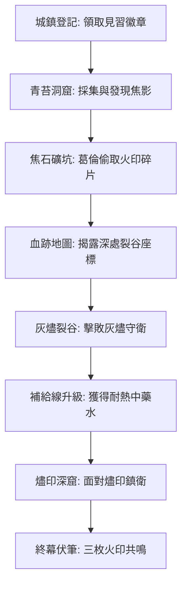

# 《元素迷宮：邊境冒險者》劇情大綱與敘事設計提案
*主編劇兼敘事設計師：Antigravity*

本提案旨在為《Element Maze／元素迷宮》的 Playable Demo 提供一個具有情感張力、世界觀深度，且完全契合現有玩法系統與地城結構的敘事框架。

---

## 1. 遊戲核心大綱

### 世界觀核心謎團：大融合的代價
艾爾姆（Aielm）大陸的邊緣被一道無法逾越的裂隙包圍，稱為**「元素深淵」**。大陸各地分布著古老的遺跡，被稱為「元素迷宮」。
*   **封印的本質**：世人（包括冒險者公會與教會）皆以為元素迷宮是古代聖賢為了「保護人類免受狂暴元素侵害」而建的封印。然而真相是：這些迷宮是古代「始源鍊金術士」建造的**巨型過濾器**。世界的地脈正受到深淵外來虛無力量（Void Maw）的侵蝕，封印將元素「割裂」是為了減緩侵蝕，但這也導致世界生命力逐漸枯竭。
*   **宿命的循環**：每隔五百年，封印便會老化、熔斷，釋放出毀滅性的元素潮汐。此時必須有「印記」的持有者深入迷宮核心重新啟動封印。而這一次，封印的衰退速度遠超預期。

### 主角為何來到艾爾姆：尋親與「無色體」
主角並非被選中的救世者，而是一個追尋失蹤導師（或父親）艾爾德林（Eldrin）足跡的年輕冒險者。
*   **元素無色體（Elemental Void Body）**：主角擁有一種罕見的特異體質——體內的元素波長呈「空白無色」狀態。這使他們能夠吸收並「合成」相互衝突的元素能量而不致爆體，同時也是唯一能觸摸並重組崩潰封印的人。
*   **空白徽記**：主角隨身攜帶導師留下的神祕遺物「空白徽記」，這引導他們來到了邊境小鎮「奧克哈芬（Oakhaven）」，因為這裡正是導師最後現身之處。

### 元素迷宮、印記與區域的關係
迷宮是「鎖」，而**「元素印記」**是「鑰匙兼能量核心」。
當某個區域的元素迷宮失穩，該區域便會發生嚴重的災變（例如火區的礦坑熔岩化、冰區的港口永久冰封）。玩家必須進入迷宮，擊敗被狂暴元素或虛無污染的「守衛者」，回收散落的「印記碎片」。當印記重組，便能暫時穩定地脈，但也將指向下一個崩潰的節點。

### 遊戲主題與情緒基調
*   **主題：封印還是融合？（Severance or Synthesis?）**
    *   *封印（教會與公會高層的立場）*：割裂力量，苟延殘喘，維持現狀的脆弱和平。
    *   *融合（虛無教團與主角最終的挑戰）*：接受混亂，將元素與人體合而為一，迎來新生但伴隨巨大危險。
*   **情緒基調**：神祕、帶有一絲末世的憂鬱與滄桑，同時強調同伴間的守望相助。視覺上以「黑暗底色與霓虹元素符文」的強烈對比，呈現古代科技與廢土奇幻的交織。

### 完整遊戲的 Act / Region 結構
*   **Act 1: 火之印記篇（邊境熔岩盆地 - 奧克哈芬）**【現有 Demo】
    *   主線：調查礦坑異動，揭發葛倫盜取火印碎片，擊敗守護者，取得「火之印記」。
*   **Act 2: 冰之印記篇（冰封特提斯遺跡 - 霜風港）**
    *   主線：火印共鳴引導至北方冰川，發現教會在此進行禁忌的「元素抽乾」實驗，釋放被凍結的古代水之聖堂。
*   **Act 3: 風雷印記篇（逐天要塞與狂嵐穹塔）**
    *   主線：飛往高空的浮空島，啟動古代飛空艇，面對失控的防禦機械，探索元素迷宮的飛行器本質。
*   **Act 4: 地之印記篇（石化古林與深淵之根）**
    *   主線：深入大地根源，目睹石化瘟疫的蔓延，抉擇是否犧牲地脈來換取地表城鎮的存活。
*   **Act 5: 始源核心篇（元素深淵 - 虛無臨界）**
    *   主線：四大印記集齊，打開通往地心深淵的大門。玩家面對世界的真相，決定艾爾姆的未來。

---

## 2. Demo 劇情重寫與填充

將現有 Demo 的四個地城與任務串聯成具有起承轉合的完整故事：



### (1) 城鎮註冊與初次認識 NPC
*   **劇情目的**：建立安全區的安全感，介紹主要 NPC（諾亞、伊芙、拉比、米菈），引導職業選擇。
*   **玩家動機**：為了尋找導師 Eldrin 的線索，必須取得公會註冊身份才能合法進入迷宮。
*   **衝突與揭露**：登記時，接待員**諾亞**一眼認出主角手上的「空白徽記」，但他神色一變，低聲警告主角將徽記藏好，並給予「見習徽章」作為掩護。這暗示公會高層正在搜捕與 Eldrin 有關的人。
*   **引導下一步**：諾亞表示：「想在邊境活下去，先幫公會跑個腿。最近青苔洞窟有些異常的焦味，去採集點素材，順便探探路。」

### (2) 青苔洞窟 (Moss Cave)
*   **劇情目的**：教學地城，引入元素侵蝕的概念。
*   **玩家動機**：收集「青苔纖維」與「破裂石片」，證明自己的生存能力，並解鎖城鎮的合成屋。
*   **衝突與揭露**：在第 12 步遇見 **裂石小魔像**。擊敗後，玩家發現它體內的核心呈現赤紅色，且洞窟深處的青苔已經焦黑碳化。這本不該是火系區域，卻有火元素外溢。
*   **地城敘事事件**：在探索中撿到一具焦黑的冒險者遺骸，包包裡有一封未寄出的信，寫著：「礦坑底下有紅色的影子……那不是野獸，是人在引火……」
*   **引導下一步**：回城交付任務。諾亞看著碳化的石片，臉色凝重。鐵匠**拉比**認出這是一種特殊的礦山萃取殘渣，懷疑有人在「焦石礦坑」私自提煉古物，促使玩家前往調查。

### (3) 焦石礦坑與葛倫 (Scorched Mine & Glen)
*   **劇情目的**：引入人類敵對勢力，展示人為的破壞加速了封印崩潰。
*   **玩家動機**：調查私採火印礦石的源頭，阻止火元素暴走威脅小鎮水源。
*   **衝突與揭露**：礦坑內熱浪逼人。第 18 步，玩家撞見**山寨頭目葛倫**。他正指揮手下用古代逆向設備抽取地脈的火元素。葛倫嘲笑主角是「公會的走狗」，並透露公會早就知道這裡的封印在熔斷，卻只顧著粉飾太平。
*   **Boss 戰演出**：
    *   *戰前*：葛倫揮舞著大斧，斧刃上燃燒著不穩定的紅光：「公會沒告訴你這迷宮是個大棺材嗎？既然來了，就留下來當燃料吧！」
    *   *戰後*：葛倫被擊敗，但他大笑著啟動了過載裝置，引起礦坑坍塌並乘亂逃走。他遺留了一份沾有餘燼灰燼的「血跡地圖」。
*   **引導下一步**：玩家將「血跡地圖」帶回公會。諾亞揭示這張地圖指向被封鎖的禁區——「灰燼裂谷」，並懷疑葛倫背後有更大的勢力支持。

### (4) 灰燼裂谷與灰燼守衛 (Ash Ravine & Ash Guardian)
*   **劇情目的**：展示地脈失控的恐怖，揭示守衛者的宿命。
*   **玩家動機**：追蹤葛倫的去向，阻止裂谷的火山灰徹底掩埋奧克哈芬。
*   **衝突與揭露**：裂谷中飄滿了燃燒的灰燼。玩家在探索中發現，裂谷的野生怪物（灰燼小鬼、燼火兵）身上都有著類似符文的烙印，暗示有人在此批量引導元素力量。
*   **地城敘事事件**：玩家在一個破敗的古代祭壇前，體內的「無色體」突然與祭壇共鳴，腦海中閃過畫面：導師 Eldrin 曾跪在此處，試圖用自己的血穩住崩潰的符文，而一個穿著教會高階長袍的背影冷冷地看著他。
*   **Boss 戰演出**：
    *   *戰前*：巨大的石質巨像**灰燼守衛**擋在路上。它的胸口有一個被粗暴挖開的空洞（原本裝有火印碎片），導致其體內能量暴走，流出熔岩般的淚水，痛苦地怒吼。
    *   *戰後*：守衛倒下，化為熄滅的餘燼。玩家在其座台下發現了一封葛倫留下的嘲諷信，指出他已經把碎片帶往最深處的「燼印深窟」進行融煉。
*   **引導下一步**：由於深處溫度過高，諾亞要求玩家先收集「精煉火石」與「熔岩碎片」，由米菈與拉比協力升級補給線，製成「耐熱中藥水」，否則無法進入深層。

### (5) 炎封深層與後續伏筆 (Cinder Seal Depths & Sentinel)
*   **劇情目的**：第一幕高潮，穩定區域危機，開啟下一幕的線索。
*   **玩家動機**：進入熔岩核心，奪回被葛倫過載的火之印記碎片，封印火山。
*   **衝突與揭露**：最深處的**燼印鎮衛**正在狂暴運轉。葛倫已被鎮衛的火焰吞噬，死前將奪來的碎片拋入核心，企圖拉整個邊境陪葬。
*   **Boss 戰演出**：
    *   *戰前*：鎮衛將主角識別為「未經授權的虛無雜質」（因為無色體），揮舞烈焰巨劍發動攻擊。
    *   *戰後*：擊敗鎮衛後，核心冷卻。主角伸出手，體內的無色能量化作引力，將散落的**三枚火之印記碎片**吸入掌心。火山爆發停止了，小鎮得救。
*   **後續伏筆**：回到城鎮，主角將碎片出示給神殿的**賽恩**。賽恩沉默許久，透露這碎片上刻有北方「特提斯冰原」的象徵符文。這意味著火印的熄滅導致了全球元素天平的傾斜，北方的冰川正在加速融化，釋放出更可怕的古代災厄。同時，公會總部派來的「特使」已經抵達，準備強行回收主角手中的火印……

---

## 3. 主要角色與勢力

### 冒險者公會（邊境支部）
*   **諾亞（Noah）**
    *   *身份*：公會接待員。
    *   *私人動機*：暗中保護邊境小鎮不受公會總部的政治清洗。他曾是 Eldrin 的隊友，對 Eldrin 的失蹤抱有愧疚。
    *   *與主角關係*：名義上的僱主與引路人，實質上的保護者。
    *   *隱藏秘密*：他的左臂在多年前的探索中被虛無侵蝕，平時用厚重的繃帶與手套偽裝。他知道公會總部正在收集印記來製造武器。
    *   *代表台詞*：「別老盯著深淵看，孩子。多看看鎮上的爐火，那才是我們戰鬥的理由。」

### 聖印教會（The Order of Sacred Seal）
*   **賽恩（Sion）**
    *   *身份*：轉職神殿守衛，莊重寡言的祭司。
    *   *私人動機*：尋找教會典籍中被撕毀的「大融合紀元」真相。
    *   *與主角關係*：心靈導師，引導主角進行職業晉升與聖物 attune。
    *   *隱藏秘密*：他發現教會崇拜的「光之主」實際上是吸食元素生命力的寄生體。他的信仰正在崩潰。
    *   *代表台詞*：「當神殿的鐘聲響起，我聽到的不是救贖，而是鎖鏈收緊的聲音。」

### 商業與工匠設施
*   **伊芙（Eve）- 魔法屋**
    *   *身份*：性格乖僻、言詞犀利的魔法研究者。
    *   *私人動機*：對古代魔法體系有病態的執著，極度討厭教會的虛偽。
    *   *與主角關係*：刀子嘴豆腐心的「大師姐」。她其實是 Eldrin 在公事外的唯一弟子。
    *   *隱藏秘密*：因為進行禁忌的元素融合實驗被魔法學院驅逐。
    *   *代表台詞*：「魔法不過是精密的數學，而你，是那個最有趣的變數。付錢，然後滾去讀書。」
*   **拉比（Rabi）- 鐵匠鋪 / 工坊**
    *   *身份*：沉穩木訥的獸人鍛造大師。
    *   *私人動機*：想要鍛造出能斬斷迷宮古代合金的「究極之刃」。
    *   *與主角關係*：裝備提供者，對主角的「無色體」體質十分感興趣。
    *   *隱藏秘密*：他的祖先是迷宮魔像的建造者之一。他認為地城怪物的失控是家族的罪孽。
    *   *代表台詞*：「這鐵打得不夠熱，就像你體內的元素血脈一樣。再去挖點礦來，我幫你把它敲醒！」
*   **米菈（Mira）- 合成屋**
    *   *身份*：活潑開朗但有點笨手笨腳的鍊金術士。
    *   *私人動機*：研究用藥草和元素合成來治癒邊境流行的「灰燼病」。
    *   *與主角關係*：同齡的摯友，常為主角的魯莽冒險擔憂。
    *   *隱藏秘密*：她自己就是灰燼病患者，靠著每天服用自己調配的半成品藥劑壓制症狀。
    *   *代表台詞*：「一點點青苔纖維，再加上亮晶晶的小魔晶……砰！這就是科學與魔法的完美結晶啦！」

### 敵對勢力
*   **荒火盜賊團（Wildfire Bandits）**
    *   由葛倫率領，名義上是土匪，實則是受到不法商人與教會極端派資助的私掠隊，專門為買家偷盜迷宮內部的古代部件。
*   **虛印之群（The Unbound / 虛無教團）**
    *   崇拜元素深淵的邪教。他們認為將世界歸於虛無才是唯一的解脫，暗中破壞各地迷宮的封印。

---

## 4. 任務與對話架構

### Demo 主線任務鏈改善方案
為了避免單純的「收集素材 -> 交付」導致枯燥，應將每次交付轉化為**劇情演出與世界觀揭露**的契機：
*   **「洞窟採集」任務的重塑**：
    *   *原本*：收集青苔纖維 x3、破裂石片 x2。
    *   *重塑後*：玩家將素材交給諾亞時，諾亞會當場將纖維與石片放入公會的古舊檢測儀中。儀器突然發出刺耳的警報，石片上的火元素殘留使指針狂跳。諾亞會驚訝地看著玩家：「你的手……沒有被這些狂暴的火砂灼傷？這不可能。」隨後引導至米菈解鎖合成屋，讓玩家親自將石片與纖維合成為第一個防護道具，體會「合成」的意義。
*   **「補給線升級」任務的重塑**：
    *   *原本*：收集精煉火石 x3、熔岩碎片 x2。
    *   *重塑後*：火山灰堵塞了城鎮的水源，居民大批病倒。米菈需要熔岩碎片來製作中和劑，拉比則需要精煉火石來強化水井的過濾格柵。玩家交付素材後，會觸發城鎮井口重新噴出清泉的動態對話，讓玩家實質感受到自己的冒險拯救了鎮民，隨後才獲得強化後的耐熱藥水配方。

### NPC 對話的動態旗標（Flag）設計
NPC 對話應根據主線進度（`dungeon_clear`、`boss_defeated`）與玩家特徵進行分支：
*   **職業專屬對話**：
    *   *劍士*進入鐵匠鋪時，拉比會點評：「你的步法很穩，重斬雖然威力大，但別把力氣用乾了。」
    *   *法師*進入魔法屋，伊芙會冷笑：「哦，又是一個抱著魔法書當寶貝的學徒。聽說你剛學會了火花術？別把自己的眉毛燒了。」
*   **進度感知對話**：
    *   當 `boss_glen_defeated` 旗標為 True，鎮上的背景音樂會變得稍微明亮，雜貨商會說：「多虧你打跑了葛倫，商隊終於敢進城了！聽說你還拿到了一張奇怪的地圖？」
    *   當觸發 `fire_mark_guild_inquiry_done`（詢問火印）後，諾亞的語音會變得低沉，眼神游移，警告玩家：「總部的人要來了。記住，如果他們問起火之印記，你就說那東西在戰鬥中被燒毀了。」

---

## 5. 未來擴張藍圖（Region / Act Content Packs）

完整遊戲可透過以下 Content Packs 進行模組化擴展：

| Act / Region | 區域主題與元素 | 主要城鎮 / 據點 | 代表地城群 | 主要 NPC / 勢力 | Boss 與劇情揭露 | 與最終謎團關係 |
| :--- | :--- | :--- | :--- | :--- | :--- | :--- |
| **Act 1: 火印篇** | 熔岩、煤煙、廢棄礦坑（火） | **奧克哈芬** (Oakhaven) | 青苔洞窟<br>焦石礦坑<br>灰燼裂谷<br>燼印深窟 | 諾亞（公會）<br>賽恩（教會）<br>葛倫（盜賊） | **燼印鎮衛**<br>揭露封印衰退與有人故意盜取碎片的陰謀。 | 玩家首次發現「無色體」能容納並淨化印記碎片。 |
| **Act 2: 冰印篇** | 冰川、沉船、古代圖書館（水/冰） | **霜風港** (Galeport) | 霜凍裂隙<br>寒沼遺蹟<br>沉沒聖堂<br>冰晶深淵 | **凱倫**（盲眼學者）<br>**克羅蒂亞**（海盜船長） | **冰縛怨靈**<br>揭露教會在此暗中抽取地脈水元素，導致生態崩潰。 | 玩家得知導師 Eldrin 曾試圖阻止教會的抽取計畫。 |
| **Act 3: 風雷篇** | 浮空島、強風、古代飛行器（風/雷） | **鷹巢要塞** (Aeries) | 風聚天梯<br>雲海沈船<br>雷霆核爐<br>逐天穹塔 | **傑菲爾**（空賊）<br>**雷光大祭司** | **狂嵐領主**（雷霆風暴機械）<br>揭露迷宮其實是古代人降臨此界時的飛船引擎。 | 證實世界的元素本是外來的，封印是為了維持生態圈。 |
| **Act 4: 地印篇** | 石化巨木、結晶礦脈、地下城（地/自然） | **根底聚落** (Rootvale) | 石化密林<br>巨靈墓塚<br>魔像溫床<br>深淵樹心 | **西爾維婭**（森林巫女）<br>**古代魔像之王** | **岩塵主母**（大地意志投影）<br>抉擇：是徹底粉碎地印解放自然，還是犧牲森林維持城鎮？ | 主角必須面對「維持封印等同於慢性殺死星球」的道德困境。 |
| **Act 5: 虛無篇** | 虛無、破碎維度、終極合成（無/全） | **虛無邊界** (The Edge) | 裂解迴廊<br>合成殿堂<br>混沌原點 | 所有人齊聚一堂<br>**虛無之影**（導師的投影） | **虛無噬體 (Void Maw)**<br>決定世界走向：重新封印、徹底解放，或是元素大融合。 | 主角用自己的身體作為「終極合成釜」，決定世界的命運。 |

---

## 6. 實際劇本示例

### 劇本一：Demo 開場（冒險者登記）
*   **場景**：奧克哈芬小鎮，烏雲壓頂。冒險者公會內，壁爐劈啪作響。諾亞正在整理一疊泛黃的委託書。
*   **人物**：主角（剛推門進來，滿身雨水）、諾亞

```
[主角推開沉重的木門，風雨夾雜著泥土與微弱的焦味湧入室內。]

諾亞：（抬頭，微笑，眼神銳利地掃過主角的裝束）
「歡迎來到奧克哈芬公會支部，旅行者。在這種天氣趕路，你不是瘋子，就是有不得不來的理由。我是這裡的接待員，諾亞。」

主角：
「我想登記成為冒險者。」

諾亞：
「登記？當然可以。邊境永遠缺人，特別是那些不怕死的人。但在我拿表格給你之前……」

[諾亞的視線落在主角腰間掛著的一枚陳舊、沒有任何元素波動的空白鐵質徽記上。他的笑容瞬間收斂，手上的動作停了下來。]

諾亞：（聲音壓得極低）
「……把那枚徽記收進你的內口袋，現在。別讓門外神殿的巡邏兵看到。」

主角：（警惕地按住徽記）
「你認得這個？」

諾亞：（恢復了平常的語氣，但眼神中多了一絲複雜）
「我不認得。我只知道，十年前有一個帶著同樣徽記的瘋子深入了焦石礦坑，之後就再也沒出來。而公會總部到現在還在『懸賞』他的消息。聽我的，孩子，在邊境，保持低調才能活得久。」

[諾亞推過來一張登記表與職業名冊。]

諾亞：
「來吧，選一個你想在迷宮裡活下來的手段。劍士、法師、盜賊，還是牧師？選好了，我就把這枚『見習徽章』發給你。至少在明面上，你只是個來討生活的普通人。」
```

### 劇本二：葛倫首次現身與公會盤問
*   **場景**：焦石礦坑第 18 步，深紅色的熔岩在石壁裂縫中流淌。一台粗糙的黃銅泵浦正發出刺耳的轟鳴，將金色的火花從地下吸出。
*   **人物**：主角、山寨頭目葛倫

```
[主角擊敗了最後一隻熔岩小鬼，踏上滾燙的礦台。葛倫正站在黃銅泵浦旁，將一塊散發著刺眼紅光的碎片塞入一柄巨大的戰斧中。]

葛倫：（轉過身，狂笑，臉上滿是煤煙）
「哈哈哈哈！成功了！聽聽這聲音，這才是力量的脈搏！公會那群膽小鬼居然把這寶貝當成『災禍』封印起來，簡直是暴殄天物！」

主角：
「葛倫，停下那台機器。你正在讓整個礦坑過載！」

葛倫：（橫起燃燒著烈焰的大斧，輕蔑地看著主角）
「過載？小鬼，你懂什麼？公會給了你多少金幣，讓你來當他們的急先鋒？他們有告訴你這迷宮底下埋著什麼嗎？這根本不是什麼怪物巢穴，這是古代人留給我們的遺產！」

葛倫：
「公會和教會霸佔了上城區的溫暖，卻讓我們在邊境吃火山灰。我只是拿回屬於我的那份！既然諾亞派你來送死，那我就用這把剛餵飽火印的斧頭，送你一程！」

[戰鬥開始。]
```

*   **場景（戰後公會調查）**：公會支部。血跡地圖鋪在桌上，地圖上的紅色紋路在黑暗中發出微弱的螢光。
*   **人物**：主角、諾亞、賽恩（在一旁沉默地擦拭法杖）

```
諾亞：（看著血跡地圖，手指微微顫抖）
「這確實是葛倫的筆跡，但這上面的地脈符文……是教會內部的密規標記。賽恩，你怎麼看？」

賽恩：（抬頭，聲音冷漠如冰）
「這是『灰燼裂谷』的封印節點圖。葛倫背後有神職人員在指點他。他們想強行破開火之印記的第二重鎖。」

主角：
「教會的人為什麼要破壞封印？」

賽恩：
「不是破壞，是『回收』。當一個區域的封印崩潰，殘存的印記核心會析出純粹的元素結晶。對於聖城那些老爺來說，那是比黃金貴百倍的魔法燃料。至於奧克哈芬會不會被熔岩淹沒……他們並不在乎。」

諾亞：（拍了拍主角的肩膀，嚴肅地說）
「這已經不是簡單的討伐委託了，孩子。你拿回了地圖，阻止了葛倫的進一步破壞。但我必須正式警告你：接下來的灰燼裂谷，駐守著古代的守衛者。而且，你體內能不受火印灼傷的體質，一旦暴露給總部的特使，你將失去自由。你，還要繼續查下去嗎？」
```

### 劇本三：Demo 結尾的懸念（Act 2 的引子）
*   **場景**：轉職神殿。三枚火之印記碎片懸浮在月之井上方，散發著溫暖但狂暴的橘紅色光芒。
*   **人物**：主角、賽恩、諾亞（急促推門進來）

```
[三枚碎片在空中緩慢旋轉，突然，它們同時劇烈震動，發出一聲清脆的鳴響。懸浮的光芒瞬間轉為幽藍色，隨後直指北方。]

賽恩：（雙眼微睜，看著井水中的倒影）
「……火印在哭泣。它不是在抗拒你，而是在向它的兄弟呼喚。」

主角：
「北方？那裡有什麼？」

賽恩：
「特提斯冰原。火之印記被你收回，意味著南方的熱源被強行截斷。北方的寒冰平衡已經被打破了。如果水之印記不能在冰川徹底融化前重新穩定，奔湧的洪水將吞噬大半個艾爾姆。」

[就在這時，神殿的大門被粗暴地推開。諾亞氣喘吁籲地跑進來，手裡握著一封蓋有金色火漆的信件。]

諾亞：
「沒時間解釋了。總部的『淨化騎士團』已經過了邊境哨所。他們的公文寫得很清楚：逮捕 Eldrin 的餘黨，並沒收所有不穩定的『元素源石』。」

諾亞：（將一袋金幣和一張前往霜風港的船票塞進主角手裡）
「拿著這個，從後門走。去北方找那個盲眼學者凱倫，他知道 Eldrin 當年在冰原留下了什麼。這裡有我撐著。」

主角：
「那你呢，諾亞？」

諾亞：（解開左臂的繃帶，露出底下已經半石質化、散發著暗淡紅光的皮膚，自嘲地一笑）
「我？我這條手臂本就是迷宮給的。既然他們想要火印，就讓他們先來公會找我聊聊吧。走！」

[主角推開神殿後門，北風呼嘯而來，夾雜著冰雪的冷冽。身後，神殿的警報鐘聲開始敲響……]
```

---

## 7. 建議的第一個劇情實作切片

為了在不破壞現有穩定代碼的前提下，最大程度提升 Demo 的故事融入感，建議先落地**「焦石礦坑線索與公會盤問」**切片。

### 涉及場景與 NPC
*   **場景**：冒險者公會（Guild UI）、焦石礦坑（Dungeon Exploration 18/18）
*   **NPC**：諾亞、鐵匠拉比

### 所需劇情旗標（Flags）
1.  `boss_glen_sighted` (已在現有代碼中存在)
2.  `boss_glen_investigation_accepted` (已在現有代碼中存在)
3.  `quest_boss_glen` (已在現有代碼中存在)
4.  *新增虛擬旗標*：`glen_lore_read`（玩家在礦坑擊敗葛倫前，是否閱讀了掉落的線索，用以觸發額外對話）

### 任務與事件流程
1.  **地城發現**：玩家首次通關焦石礦坑（18/18），觸發事件：發現葛倫私採礦石的痕跡，提示「有強大且狂暴的火焰氣息在深處凝聚，且有山賊活動的痕跡。回公會向諾亞報告」。
2.  **公會盤問**：玩家回到公會，諾亞處解鎖特殊對話選項「[調查] 匯報焦石礦坑的異動」。
3.  **拉比插話**：觸發對話時，鐵匠拉比會從隔壁工作坊走過來（對話框中加入拉比的頭像與發言），指出葛倫使用的提煉工具是古代科技，並警告主角「葛倫的熔岩斧非同小可，你需要抗火裝備」。
4.  **發布任務**：諾亞正式發布 `quest_boss_glen`，解鎖焦石礦坑 18/18 的 Boss 戰挑戰權利，並解鎖合成屋的「抗火斗篷」配方。
5.  **戰鬥接軌**：玩家帶著抗火斗篷再次挑戰 18/18，擊敗 Boss 葛倫，掉落 `key_blood_map`，回城交付，開啟 Act 2 的灰燼裂谷。

### 預期玩家感受
*   **目標感提升**：玩家不再覺得「打 Boss 只是為了通關地城」，而是為了解決「山賊私採元素資源導致生態危機」的事件。
*   **NPC 鮮活化**：NPC 之間有互動（諾亞與拉比的對話），讓城鎮設施不再是孤立的選單，而是一個真正的「冒險者據點」。
*   **玩法結合**：將「抗火斗篷」的合成自然嵌入主線，玩家會主動去收集火焰石和焦黑鐵礦，消除了收集素材的強迫感。
