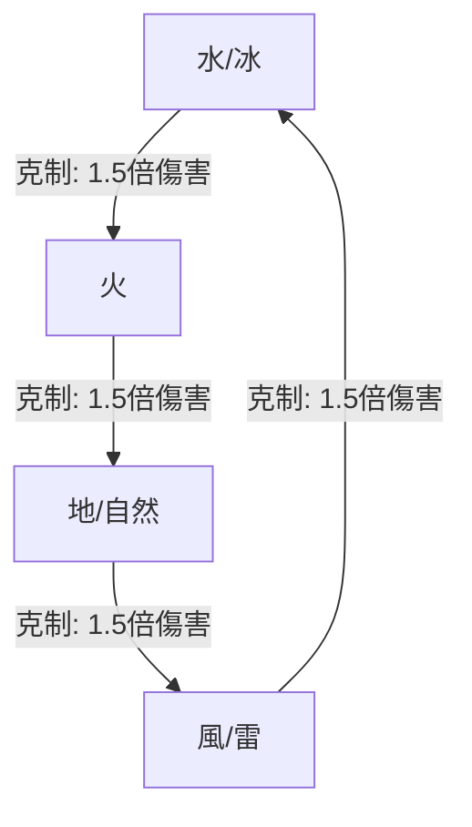

# 《元素迷宮》單人 RPG 戰鬥成長系統設計提案（屬性克制、副手裝備與單人職業定位）
*主編劇兼系統設計師：Antigravity*

本提案專為**「單人單主角 (Solo Player)」**文字冒險遊戲量身打造。在沒有隊友協助的戰鬥環境下，每個職業必須具備「自成一格的完整生存與擊殺心流」，以解決特定職業在面對小怪或 Boss 時的體驗死角。

本設計為 Paper Design 規格，在維持專案現有代碼穩定的前提下，提供未來的調整依據。

---

## 1. 元素相克矩陣 (Elemental Cycle)

為保持單人戰鬥的簡潔度，我們採用四元素閉環相克，加一個中立元素（虛無）的設計。屬性克制可造成 **1.5 倍傷害**：

*   **水/冰 ──► 火**：水流澆熄烈焰。
*   **火 ──► 地/自然**：烈火燃燒森林與大地。
*   **地/自然 ──► 風/雷**：大地（接地線）吸收並導入雷電。
*   **風/雷 ──► 水/冰**：雷電在水中傳導並凍結。
*   **虛無/無色（主角 Void 屬性）**：中立，不被任何屬性克制。在後期可以透過聖物 Attune（共鳴）轉換為上述四屬性之一，以應對特定元素迷宮。

---

## 2. 盜賊的「單人影袖副手」戰術系統

單人盜賊的核心生存手段為**「閃避（Evasion）」**，而輸出則依賴**「狀態附加與引爆」**。透過切換**「影袖裝備 (Accessory/Armor)」**，盜賊能讓普通攻擊 (平A) 附加不同的戰術效果：

### 🗡️ 裝備 A：影袖副刃·毒針 (Poison Needle)
*   **定位**：百分比扣血、消耗流。
*   **效果**：普通攻擊有 25% 機率使目標**「中毒」**（每回合損失 6% 最大 HP，持續 3 回合）。
*   **單人連擊**：使用技能「致命毒爆」，若目標處於中毒狀態，直接引爆賸餘毒素傷害，並使敵人陷入「致盲（物理/魔法命中率降低 50%，持續 2 回合）」。

### 🩸 裝備 B：影袖副刃·血鉤 (Blood Hook)
*   **定位**：物理破甲、爆發流。
*   **效果**：普通攻擊有 20% 機率使目標**「流血」**（防禦力降低 20%，且每次受擊追加額外物理傷，持續 3 回合）。
*   **單人連擊**：使用技能「疾風雙重刺擊」，對流血目標造成雙倍傷害。

### 🌀 裝備 C：影袖副刃·噬魔刺 (Mana Thorn)
*   **定位**：極限續航、吸血流。
*   **效果**：普通攻擊有 15% 機率觸發**「吸血/吸魔」**（回復該次傷害 15% 的 HP 與 MP）。

---

## 3. 戰士 (Swordsman) —— 「不屈的鐵壁狂戰」 (Stagger & Execute)

*   **單人痛點**：平A清怪安逸，但打王時缺乏元素屬性與爆發，戰鬥平淡緩慢。
*   **單人解法 ──【失衡與斬殺心流】**：
    戰士不依賴元素魔法，而是透過**「招架敵方傷害」**與**「打碎敵方防線」**來輸出。戰士能快速累積 Boss 的**「失衡值 (Stagger Bar)」**。當 Boss 失衡時，防禦歸零，戰士便可發動威力巨大的物理斬殺。

### 核心技能配置
1.  **破甲巨盾擊 (Shield Slam)** (主動技能)
    *   *消耗*：低 MP。
    *   *效果*：造成中等物理傷害，並累積目標大量**「失衡值」**。若目標處於攻擊準備狀態，此技能有機率打斷其施法。
2.  **不屈招架 (Iron Parry)** (主動技能)
    *   *消耗*：中等 MP。
    *   *效果*：本回合進入防禦姿態。若受到物理攻擊，免除 80% 傷害，並將免除傷害量的 50% 轉化為下回合的「怒氣（攻擊力加成）」。
3.  **無畏斬殺 (Fearless Execute)** (主動技能)
    *   *消耗*：高 MP。
    *   *效果*：消耗所有怒氣，對單體造成毀滅性物理傷害。**若目標處於「失衡狀態」，此技能傷害提升 150%**。

---

## 4. 牧師 (Priest) —— 「不滅的荊棘祭司」 (Reflect & Holy Burst)

*   **單人痛點**：物理攻擊力低，打小怪效率極差、體驗枯燥；缺乏高爆發法術。
*   **單人解法 ──【神聖爆震與鏡面反射】**：
    牧師擁有全職業最高的 HP 與續航力。在單人作戰中，他打小怪依靠**「過量治療爆震（範圍傷害）」**；打 Boss 則依靠**「護盾傷害反射（王打自己等於打牠自己）」**，以防守轉化為最強的進攻。

### 核心技能配置
1.  **甦醒與爆震 (Holy Burst Rejuvenation)** (主動技能)
    *   *消耗*：中等 MP。
    *   *效果*：為自身施加持續治療（HoT），每回合恢復 HP。**若自身血量已滿，每回合的過量治療量將轉化為「神聖爆震」，對全體敵人造成等量的神聖法術傷害**（大幅加快清小怪效率）。
2.  **鏡面聖言盾 (Mirror Shield)** (主動技能)
    *   *消耗*：高 MP。
    *   *效果*：為自身凝聚一面聖光盾。盾牌存在期間，**將受到的所有傷害按 40% 的比例反彈給攻擊者**，並免疫所有異常狀態。
3.  **荊棘印記 (Thorn Mark)** (主動技能)
    *   *消耗*：低 MP。
    *   *效果*：使目標每回合損失 3% 的「當前生命值」（Current HP），且主角在攻擊該印記目標時，傷害的 20% 轉化為自身 HP，持續 5 回合。

---

## 5. 法師 (Mage) —— 「風箏的元素編織者」 (Control & Kiting)

*   **單人痛點**：血量極低（玻璃大砲），在沒有前排坦克阻擋的情況下，極易被怪物貼身秒殺。
*   **單人解法 ──【冰凍控場與法力護盾】**：
    單人法師必須是**「控場大師」**。依靠水/冰魔法將怪物的速度降到最低，拉開距離進行吟唱，並用 MP 代替生命值承受傷害。

### 核心技能配置
1.  **冰針術 (Ice Needle)** (主動技能)
    *   *消耗*：低 MP。
    *   *效果*：射出冰針造成冰屬性傷害，並使目標陷入**「遲緩」**狀態（敏捷降低 30%，持續 2 回合）。
2.  **法力護盾 (Mana Shield)** (被動/主動技能)
    *   *效果*：當受到傷害時，**將 70% 的傷害量優先扣除 MP（按 1 MP : 2 HP 的比例折算）**，極大避免被王一擊秒殺。
3.  **寒冰爆震 (Glacial Nova)** (主動技能)
    *   *消耗*：高 MP。
    *   *效果*：對敵方全體造成冰屬性傷害，並使所有被「遲緩」的目標陷入**「凍結」**狀態（無法行動 1 回合）。

---

## 6. 戰鬥目標數量與難度控制 (Target Quantity & Difficulty Control)

為防止物理職業在單人作戰中因面對多個對手而過度消耗藥水，戰鬥目標的數量必須嚴格遵守以下限制與設計：

### A. 數量限制規則 (Target Rules)
*   **Act 1 與 Act 2**：不論是小怪戰還是 Boss 戰，一律強制為 **1 對 1** (1 Player vs. 1 Enemy) 決鬥模式。
*   **Act 3 及以後 (風雷篇起)**：
    *   *普通小怪戰*：維持 **1 對 1**，以確保探險清圖時的資源平穩。
    *   *特定首領戰 (Boss)*：允許實裝**複數敵人（1 對 多）**的挑戰模式（例如：Boss 召喚 1~2 隻小怪，或是「風雷雙衛」雙 Boss 戰）。

### B. 複數敵人 Boss 戰的四職業應對手段
當面對複數敵人時，各職業擁有獨特的「免傷/控場」反制機制，避免被怪物的合擊秒殺：

1.  **戰士 ──【全方位招架】**：
    *   戰士的「不屈招架」被設計為**對本回合受到的「所有」物理攻擊生效**。當面對 3 隻怪物同時攻擊時，一次招架能免除全部 3 次傷害，並累積成三倍的斬殺怒氣。
2.  **盜賊 ──【煙幕致盲與分開蠶食】**：
    *   盜賊能利用「毒針 + 致命毒爆」快速**「致盲」**一隻威脅最大的敵人（降低其 50% 命中率），並利用極高閃避拉扯，先集中火力平A擊殺另一隻。
3.  **法師 ──【群體冰凍控場】**：
    *   法師是面對複數敵人時的最強職業。一記「寒冰爆震（Glacial Nova）」可以直接將全場被遲緩的怪物集體**「凍結」**，重新奪回戰鬥節奏。
4.  **牧師 ──【神聖爆震與鏡面盾反射】**：
    *   牧師不需要切換目標，只要施加「甦醒」，過量治療產生的「神聖爆震」會自動對**敵方全體**造成範圍傷害；同時，當有 3 隻怪物打牧師時，牧師的鏡面盾會同時反彈 3 個敵人的傷害，王召喚的小怪越多，受到的反射傷害就越高。

