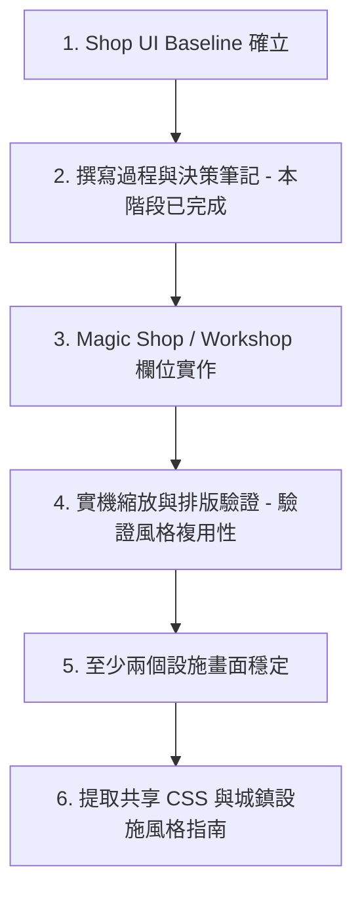

# Shop Skinning Lab v0.2.2 - 商店介面優化與決策歷程筆記

本文件記錄《元素迷宮：邊境冒險者》商店設施畫面（Shop Screen）在 `08_experiments/mockup_to_html/shop_skinning_lab/` 實驗室中，從開發者測試介面（developer-facing isolated lab）演進為玩家端正式 UI 視覺基準（player-facing visual baseline）的優化過程與設計決策。

---

## 1. Shop UI 完成狀態與定位

目前 Shop Skinning Lab 已形成第一個可接受的正式 UI 視覺基準，其定位與邊界如下：
* **設施畫面的第一個視覺基準 (Facility Visual Baseline)**：本畫面確立了城鎮設施（Facility Screen）在桌面端/PC 平台展示的標準排版結構。
* **非全遊戲最終 Design System**：本畫面目前僅代表城鎮設施類的視覺風格，不直接等同於戰鬥、世界地圖或主選單等其他系統的最終樣式。
* **非共享 CSS (Shared CSS)**：目前的樣式完全收納於本實驗室中，並非提取後的通用樣式庫。後續 Magic Shop (魔法商店)、Workshop (鐵匠鋪)、Synthesis (合成屋) 等畫面在風格延伸時可參考此樣式，但仍需**逐個畫面單獨進行實機排版與縮放驗證**。

---

## 2. 與原版配置相比「保留」了什麼

為確保功能完整度，本版 UI 仍保留了原版原型（Prototype）中所有核心的功能結構與程式碼鉤子（Hooks）：
* **商品列表 (Item List)**：左側商品項目的多行展示結構，包含名稱、價格、持有量及庫存狀態。
* **商品分類頁籤 (Category Tabs)**：上方橫向頁籤，用於切換「全部商品」、「補給品」、「戰術道具」與「飾品」等分類。
* **商品詳情 (Item Detail)**：中間上方卡片，展示選中商品的說明、效果、使用限制與詳細說明文字。
* **購買要求與限制 (Requirement Panel)**：中間下方區塊，以列表呈現金幣需求等條件滿足狀態。
* **Footer 行動按鈕區 (Footer Actions)**：底部包含返回按鈕、對話提示框與主要購買按鈕的排版。
* **主要/次要動作按鈕 (Primary / Secondary Buttons)**：包含「返回城鎮」次要按鈕，以及依商品名稱動態呈現的「購買 [商品名]」主要按鈕。
* **回饋訊息提示框 (Feedback Message)**：對話框形式的文本渲染區，動態呈現 NPC 特里的引導與交易回饋。
* **UIAction Log / 實驗室行為驗證**：DOM 中保留了日誌清單與 fixture 切換下拉選單的完整結構，保證 `shop_skinning_lab.js` 中的互動狀態與 UIAction 事件日誌能正常運作並記錄。

---

## 3. 與原版配置相比「隱藏或刪除」了什麼

為了提升玩家端的沉浸感，以下原版中屬於開發/調試用途、或過度繁雜的元素，在本次設計決策中**刻意隱藏、弱化或不予渲染**。**此處為刻意設計，並非漏做**：
* **資源條 (Resource Strip)**：在 `fixtures.js` 的場景數據中，商店畫面的 `resource_strip` 設定為 `null`，使其預設隱藏。
* **測試狀態切換器 (Fixture Switcher)**：`.fixture-switcher` 下拉選單在 CSS 中加入 `display: none !important;` 隱藏，僅保留 DOM 與 JS 切換機制，使玩家畫面乾淨。
* **說明性副標題 (Subtitle)**：商店頂部的說明副標 `#screen-subtitle` 透過 CSS 隱藏，防止開發說明文字外露，但 DOM 節點完整保留以供 JS 寫入安全。
* **商鋪 kicker 標籤**：標題上方的輔助 kicker 標籤 `.screen-label`（顯示為「商鋪」）在 CSS 中完全隱藏。
* **NPC 文字資訊面板**：隱藏了原版右側的「行商 特里」等靜態文字面板（`.npc-copy`），以清空空間。
* **NPC Placeholder 佔位框**：移除原本在右側帶有灰底與 debug 文字的佔位元素，改為純淨的角色視覺安全區。
* **UIAction Log 面板**：將位於頁尾底部的 `.action-log-panel` 面板以 `display: none !important;` 隱藏，避免玩家看見開發調試用日誌，但 DOM 依然保留。

---

## 4. 背景與 NPC 展示方式的決策

右側欄位（Column 3）的定位在此次優化中經歷了根本性的轉變：
* ** shopkeeper presence / 視覺展示區**：右側區域不再包含任何表格或文字資訊框，而是設定為完全透明的 **角色展示安全區 (NPC Visual Stage)**。
* **背景與角色立繪結合**：畫面底層鋪設滿版背景圖（`bg-npc.jpg`），右側欄位僅作為角色立繪疊加的安全通道。
* **無 Debug 邊框與文字**：移除了原本 dashed 虛線佔位框與 `NPC Visual Stage` 的浮水印文字。
* **非強制設計**：未來其他設施畫面（如合成屋或倉庫）可參考此排版邏輯，但並不意味著所有設施都必須具備右側 NPC 欄位。

---

## 5. Layout 調整紀錄

最終確定的版面結構如下：
* **三欄式主版面 (Main Layout)**：
  * **左側商品欄 (Catalog Column)**：使用穩定的 `var(--catalog-col)` 寬度，數值為 `clamp(360px, 24vw, 430px)`。
  * **中間詳情欄 (Detail Column)**：使用固定寬度 `var(--detail-col)`，數值為 `460px`。
  * **右側角色欄 (NPC Column)**：使用自適應寬度 `var(--npc-col)`，數值為 `minmax(420px, 1fr)`。
* **Footer 跨欄底座 (Footer Grounding)**：
  * `.shop-footer` 設定為 `grid-column: 1 / 4`（橫跨三欄），其深色半透明背板延伸至右側邊界，為整頁 UI 奠定視覺底座。
  * Footer 內部控制項（返回、提示框、購買按鈕）分配為三欄：`clamp(260px, 20vw, 320px) minmax(0, 1fr) clamp(260px, 20vw, 320px)`，在水平方向上均勻分佈，購買按鈕位於右下角且完整顯示。
* **本輪關鍵修正（Footer 與右下按鈕裁切修復）**：
  * **問題**：在上一版中，右下角購買按鈕（Primary Action Button）被右側邊界裁切。
  * **成因**：Footer 的背板深色橫條設計過寬，或因錯誤的 padding-right 與欄寬計算導致溢出。
  * **解決方法**：採用 **CSS-only（無損 HTML 結構）** 的方式，移除 `.shop-footer` 的右側 NPC 避讓 padding，加上 `width: 100%; max-width: 100%; min-width: 0;`。重構 footer 網格欄寬，並將按鈕高度固定為 `70px`，使其在 `100%`、`90%` 與 `67%` 縮放比例下均能完美呈現，無任何裁切或溢出。

---

## 6. 確立之視覺風格方向

* **桌面端 JRPG 風格 (PC Desktop / Tabletop-style JRPG UI)**：
  * 排版以傳統單機 JRPG 的高密度資訊卡片為藍本，不採用行動端觸控的大按鈕配置。
* **黑曜石與暗色面板 (Obsidian & Dark Panels)**：
  * 採用極低亮度的半透明黑曜石底板（`rgba(13, 15, 18, 0.96)`），搭配毛玻璃模糊背景。
* **金色/暗銅金色裝飾 (Gold / Brass Ornaments)**：
  * 面板邊界套用薄金線（`var(--line)`），卡片角落帶有精緻的小星芒裝飾 `✦`。
* **漸變遮罩標題飾板 (Title Plaque)**：
  * 標題「星燈行商鋪」被包裹於獨立的飾板中，背景向右進行線性漸變淡出（`linear-gradient`），左側以厚金線收邊。
* **選中高光與 Badge 印章**：
  * 選中的商品套用溫慢的琥珀金光暈（`selected glow` / `var(--amber-glow)`）。
  * 狀態徽章（如「可購買」）縮小並以邊框印章形式呈現，降低開發工具感。

---

## 7. 後續用途與流程指引

* **防退化屏障**：此筆記可防止後續 agent 在接續任務時，誤將已刪除、隱藏或弱化的元素（如 switcher、原本右側的文字資訊框）重新加回 DOM 或樣式中。
* **風格複用引導**：此筆記可作為 Magic Shop、Workshop 等其他 Facilities 風格複用的藍圖。

### 建議後續開發流程：

